# Adrian Sandoval-Vargas
## CSI 5810 Assignment 1

Throughout all this homework assignment I used python as the primary langauge to compute and visualize the data. Within the python langauge, I used libraries suchas numpy, pandas, sklearn, and matplotlib. These libraries were extremely useful. I also referred to the From Data to Decision tutorial as mentioned in lectures.

## **Question 1**

For this question I wanted to compare the Salary Vs. Sex, Education, and Country of Origin given the data set of [Census Income Data Set]. First, a simple data representation of Male Vs Female.
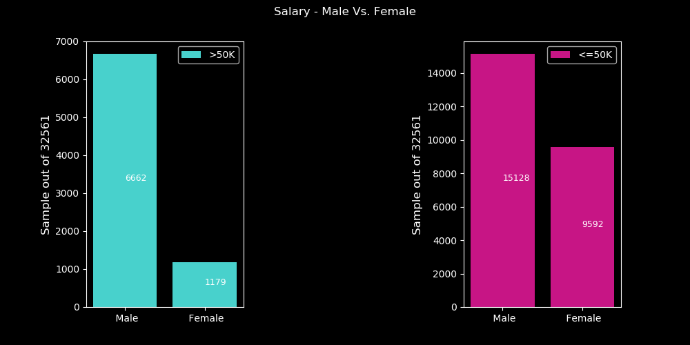
>
>We can seee that there are alot more Males than Females, but we can see that males have a greater presence in both >50k and <=50k. Outof the sample size of 7841 that made >50k, 85% were males and 15% were females. Outof 24720, 61% were male and 39% were female.

<br>
<br>
<br>
<br>
<br>
<br>
<br>
<br>
<br>
<br>
<br>
<br>
<br>
<br>
<br>
<br>
<br>
<br>
<br>

Further, I will be comparing the education of Male and Females that made >50k and <=50k.

<table height="50">
<tr>
<td aling="right">50k.png" alt="bar" title= "Education of >50k" width="300" /></td>
<td align="left">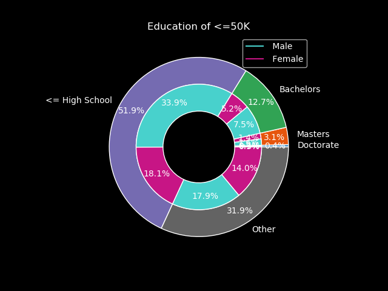</td>
</tr>
<tr>
<td align="right"></td>
<td align="left">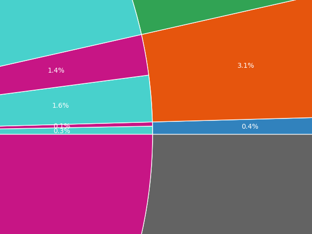</td>
</tr>
</table>

>*NOTE: The 'Other' section represents Associates, Technical School, Professional School, or other type of degree. Also the bottom right visualization is a close up of 'Education of <=50k'*. We can see from the set of pie graphs that Males had more education than Females. For those who made >50k, 75.5% held a degree, certificate, or had some college while 24.5% made more than 50k with HS-Diploma or less. In contrast, 51.9% of the people that made <=50k had a HS-Diploma or didn't finish Hightschool. It is evident to see from these visualizations that going for higher education contributes to a higher chance of making >50k.

Lastly, lets look at Foreign Vs US born and its relation with Education, Sex, and Salary. Due to the fact that the census is in the USA we can see that there will be more USA Born people with more education making more. I will analyze >50k, then <=50k.

50k.png" alt="bar" title= "Education By Country" width="700"/>

> From the US Born population, the points with the smallest difference between them is Males and Females who own Doctorates. The rest, are heavily skewed towards males.
> <br>From the Foreign Born population, we can see that Philippines males and females have the most bachelors and making >50k in there respective sex.
>>**Males**:
>><br>**Taiwan** - had the most Doctorates
>><br>**India** - had the most Masters
>><br>**Philippines** - had the most Bachelors
>><br>**Mexico** - had the most with High School or Less
>><br>**Germany** - had the most with some Other type of education
>>**Females**:
>><br>**Italy & Germany** - had the most Doctorates
>><br>**China & Taiwan** - had the most Masters
>><br>**Philippines** - had the most Bachelors
>><br>**Canada** - had the most with High School or Less
>><br>**Canada** - had the most with some Other type of education

Now Lets look at <=50k.

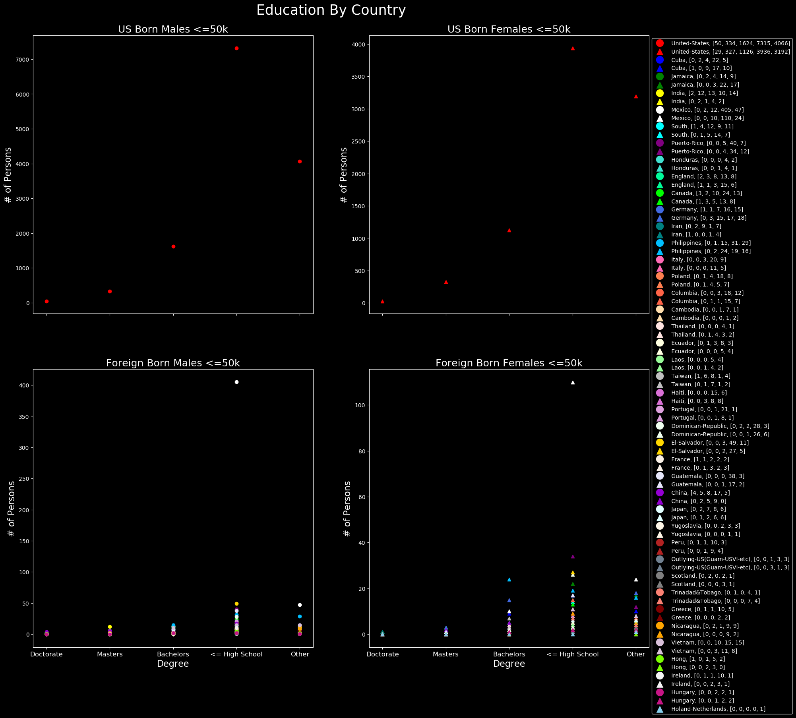

> From the US Born population, we can see a similar trend on both male and female populations. As the education drops, the number people making <=50k increases at an exponential rate (with the exception for the 'Other' categoy)
> <br>From the Foreign Born population, we can see a similar situation though not as significant.
>><br>One notable country is **Mexico** who has the majority of <= Highschool making <= 50k.

These graphs give us an insight on how Education plays into salary, then how those two salary sections are distributed by sex, and finally the amount of foreign born people who come to USA and proceed an education (or come with it already) and how they are paid according to sex and education. It is important to note that during this time there was very little talks about equal pay for females.
### **Code For Above Charts**
```python
import numpy as np
import pandas as pd
import matplotlib.pyplot as plt
from matplotlib.lines import Line2D
from matplotlib import style

from sklearn import datasets

headers = ['age','workclass','fnlwgt','education',
'education-num','marital-status','occupation','relationship'
,'race','sex','capital-gain','captial-loss','hours/week',
'native-country','salary']

data = pd.read_csv("~/Downloads/adult.data", header = None, names = headers )
plt.style.use('dark_background')
#data = data[data["sex"] == ' Male']
#data = data[data["age"] == 22]

#Bargraph prelimiary data
sex = data.sex.unique()
more = data[data["salary"] == " >50K"]
less = data[data["salary"] == " <=50K"]

maleMore = more[more["sex"] == " Male"]
femaleMore = more[more["sex"] == " Female"]
maleLess = less[less["sex"] == " Male"]
femaleLess = less[less["sex"] == " Female"]

'''
#---------Bar Graph stuff------
composite = [len(maleMore.index), len(femaleMore.index)]
composite2 = [len(maleLess.index), len(femaleLess.index)]
#print(len(sex))

#plt.hist(data[1], color = 'g')
#Bargraph male Vs female
plt.figure(figsize=(10, 5))
plt.subplot(131)
plt.bar(sex, composite, color="mediumturquoise", label=">50K")
#labels on bars
for i in range(len(sex)):
    plt.text(x = sex[i], y=composite[i]/2, s = composite[i],size = 6, fontsize=9)
plt.legend()
plt.ylabel('Sample out of ' + str(len(data.index)), fontsize="12")
plt.subplot(133)
plt.bar(sex, composite2, color="mediumvioletred", label="<=50K")
for i in range(len(sex)):
    plt.text(x = sex[i], y=composite2[i]/2, s = composite2[i], size = 6, fontsize=9)

plt.legend()
plt.ylabel('Sample out of ' + str(len(data.index)), fontsize="12")
#plt.title('Male Vs. Female \n>50K')
#plt.xlabel('Sex')
#plt.ylabel('Sample out of ' + str(len(data.index)), fontsize="12")
plt.suptitle("Salary - Male Vs. Female")
#---------End of Bar---------'''
#education = data.education.unique()
#print(education)
'''
#-----------Pie Graph >50K-----------
education = [len(more[more["education"] == " Doctorate"]), 
             len(more[more["education"] == " Masters"]),
             len(more[more["education"] == " Bachelors"]),
             len(more[more["education"].isin([" HS-grad", " 11th", " 9th", " 7th-8th", " 5th-6th", " 10th", " 1st-4th", " Preschool", " 12th"])]),
             len(more[more["education"].isin([' Some-college', ' Assoc-acdm', ' Assoc-voc', ' Prof-school'])])
            ]   

#maledoc = maleMore[maleMore["education"] == " Doctorate"]
#maleMas = maleMore[maleMore["education"] == " Masters"]
#maleBac = maleMore[maleMore["education"] == " Bachelors"]
#maleHS  = maleMore[maleMore["education"].isin([" HS-grad", " 11th", " 9th", " 7th-8th", " 5th-6th", " 10th", " 1st-4th", " Preschool", " 12th"])]
#maleOth = maleMore[maleMore["education"].isin([' Some-college', ' Assoc-acdm', ' Assoc-voc', ' Prof-school'])]
#print(maleHS[["education", "sex", "salary"]])

maleFemale = [len(maleMore[maleMore["education"] == " Doctorate"]),
    len(femaleMore[femaleMore["education"]== " Doctorate"]),
    len(maleMore[maleMore["education"] == " Masters"]),
    len(femaleMore[femaleMore["education"]== " Masters"]),
    len(maleMore[maleMore["education"] == " Bachelors"]),
    len(femaleMore[femaleMore["education"]== " Bachelors"]),
    len(maleMore[maleMore["education"].isin([" HS-grad", " 11th", " 9th", " 7th-8th", " 5th-6th", " 10th", " 1st-4th", " Preschool", " 12th"])]),
    len(femaleMore[femaleMore["education"].isin([" HS-grad", " 11th", " 9th", " 7th-8th", " 5th-6th", " 10th", " 1st-4th", " Preschool", " 12th"])]),
    len(maleMore[maleMore["education"].isin([' Some-college', ' Assoc-acdm', ' Assoc-voc', ' Prof-school'])]),
    len(femaleMore[femaleMore["education"].isin([' Some-college', ' Assoc-acdm', ' Assoc-voc', ' Prof-school'])])
]

fig, ax = plt.subplots()
size = 0.3
#vals = np.array([[60., 32.], [37., 40.], [29., 10.]])
#vals = [len(maledoc), len(maleMas), len(maleBac), len(maleHS), len(maleOth)]
outLabels = ['Doctorate', 'Masters', 'Bachelors', '<= High School', 'Other']
innerLabels = [sex[0],sex[1],sex[0],sex[1],sex[0],sex[1],sex[0],sex[1],sex[0],sex[1]]

cmap = plt.get_cmap("tab20c")
outer_colors = cmap(np.arange(5)*4)
colors = ["mediumturquoise", "mediumvioletred"]
inner_colors = ["mediumturquoise", "mediumvioletred",
                "mediumturquoise", "mediumvioletred",
                "mediumturquoise", "mediumvioletred",
                "mediumturquoise", "mediumvioletred",
                "mediumturquoise", "mediumvioletred", ]


ax.pie(education, labels=outLabels, radius=1, colors=outer_colors,
       wedgeprops=dict(width=size, edgecolor='w'), autopct='%1.1f%%', pctdistance=.85)
#ax.pie(vals.sum(axis=1), radius=1, colors=outer_colors,
 #      wedgeprops=dict(width=size, edgecolor='w'))


ax.pie(maleFemale, radius=1-size, colors=inner_colors,
       wedgeprops=dict(width=size, edgecolor='w'), autopct='%1.1f%%', pctdistance=.80)

pat = [Line2D([0], [0], color = colors[0], label=sex[0]), Line2D([0], [0], color = colors[1], label=sex[1])]
ax.legend(handles = pat, loc = "upper right" )
ax.set(aspect="equal", title='Education of >50K')
fig.savefig("pie_chart_of_>50k.png", format='png')

#------------End Pie Graph----------
'''
'''
#-----------Pie Graph <=50K-----------
education = [len(less[less["education"] == " Doctorate"]), 
             len(less[less["education"] == " Masters"]),
             len(less[less["education"] == " Bachelors"]),
             len(less[less["education"].isin([" HS-grad", " 11th", " 9th", " 7th-8th", " 5th-6th", " 10th", " 1st-4th", " Preschool", " 12th"])]),
             len(less[less["education"].isin([' Some-college', ' Assoc-acdm', ' Assoc-voc', ' Prof-school'])])
            ]   

maleFemale = [len(maleLess[maleLess["education"] == " Doctorate"]),
    len(femaleLess[femaleLess["education"]== " Doctorate"]),
    len(maleLess[maleLess["education"] == " Masters"]),
    len(femaleLess[femaleLess["education"]== " Masters"]),
    len(maleLess[maleLess["education"] == " Bachelors"]),
    len(femaleLess[femaleLess["education"]== " Bachelors"]),
    len(maleLess[maleLess["education"].isin([" HS-grad", " 11th", " 9th", " 7th-8th", " 5th-6th", " 10th", " 1st-4th", " Preschool", " 12th"])]),
    len(femaleLess[femaleLess["education"].isin([" HS-grad", " 11th", " 9th", " 7th-8th", " 5th-6th", " 10th", " 1st-4th", " Preschool", " 12th"])]),
    len(maleLess[maleLess["education"].isin([' Some-college', ' Assoc-acdm', ' Assoc-voc', ' Prof-school'])]),
    len(femaleLess[femaleLess["education"].isin([' Some-college', ' Assoc-acdm', ' Assoc-voc', ' Prof-school'])])
]

fig, ax = plt.subplots(subplot_kw=dict(aspect="equal"))
size = 0.3
#vals = np.array([[60., 32.], [37., 40.], [29., 10.]])
#vals = [len(maledoc), len(maleMas), len(maleBac), len(maleHS), len(maleOth)]
outLabels = ['Doctorate', 'Masters', 'Bachelors', '<= High School', 'Other']
innerLabels = [sex[0],sex[1],sex[0],sex[1],sex[0],sex[1],sex[0],sex[1],sex[0],sex[1]]

cmap = plt.get_cmap("tab20c")
outer_colors = cmap(np.arange(5)*4)
colors = ["mediumturquoise", "mediumvioletred"]
inner_colors = ["mediumturquoise", "mediumvioletred",
                "mediumturquoise", "mediumvioletred",
                "mediumturquoise", "mediumvioletred",
                "mediumturquoise", "mediumvioletred",
                "mediumturquoise", "mediumvioletred", ]


ax.pie(education, labels=outLabels, radius=1, colors=outer_colors,
       wedgeprops=dict(width=size, edgecolor='w'), autopct='%1.1f%%', pctdistance=.85)

ax.pie(maleFemale, radius=1-size, colors=inner_colors, wedgeprops=dict(width=size, edgecolor='w'), autopct='%1.1f%%', pctdistance=.80)

pat = [Line2D([0], [0], color = colors[0], label=sex[0]), Line2D([0], [0], color = colors[1], label=sex[1])]
ax.legend(handles = pat, loc = "upper right" )
ax.set(aspect="equal", title="Education of <=50K")
fig.savefig("pie_chart_<=50.png", format='png')
#------------End Pie Graph----------
'''
'''
#-----------Scatter Plot >50k Education Vs. Country----------
# Preview Nice
# fig, ax = plt.subplots(2, 2, figsize=(10, 25), sharex=True)
fig, ax = plt.subplots(2, 2, figsize=(16, 16), sharex=True)
country = data["native-country"].unique()
filtered_country = np.delete(country, 4)

vals = []
colors = ['red', 'blue', 'green', 'yellow', 'white', 'cyan', 'purple', 'turquoise', 'mediumspringgreen', 'lime', 'royalblue', 'teal', 'deepskyblue', 'hotpink', 'coral', 'tomato', 'navajowhite',
 'mistyrose', 'lightyellow', 'palegreen', 'silver', 'orchid', 'plum', 'honeydew', 'gold', 'linen', 'lavender', 'darkviolet', 'lightcyan', 'oldlace', 'firebrick', 'slategray', 'grey', 'salmon', 'maroon',
 'orange', 'thistle', 'lawngreen', 'whitesmoke', 'mediumvioletred', 'skyblue', 'khaki']
labels = ['Doctorate', 'Masters', 'Bachelors', '<= High School', 'Other']
pat = []
xLabel = "Degree"
yLabel = "# of Persons"

for i in range(0, len(filtered_country)):
    #USA DATA
    if i == 0:
        #Males
        vals = [len(maleMore[(maleMore["education"] == " Doctorate") & (maleMore["native-country"] == filtered_country[i])]),
            len(maleMore[(maleMore["education"] == " Masters") & (maleMore["native-country"] == filtered_country[i])]),
            len(maleMore[(maleMore["education"] == " Bachelors") & (maleMore["native-country"] == filtered_country[i])]),
            len(maleMore[(maleMore["education"].isin([" HS-grad", " 11th", " 9th", " 7th-8th", " 5th-6th", " 10th", " 1st-4th", " Preschool", " 12th"])) & (maleMore["native-country"] == filtered_country[i])]),
            len(maleMore[(maleMore["education"].isin([' Some-college', ' Assoc-acdm', ' Assoc-voc', ' Prof-school'])) & (maleMore["native-country"] == filtered_country[i])])]
        ax[0, 0].scatter(labels, vals, c = colors[i])
        pat.append(Line2D([0], [0], marker='o', color='black', label=filtered_country[i] + ", " +str(vals)+"" , markerfacecolor= colors[i], markersize=15))
        ax[0, 0].set_title("US Born Males >50k", fontsize = 18)
        #ax[0, 0].set(ylabel = yLabel)
        ax[0, 0].set_ylabel(yLabel, fontsize = 16)
        #Females
        vals = [len(femaleMore[(femaleMore["education"] == " Doctorate") & (femaleMore["native-country"] == filtered_country[i])]),
            len(femaleMore[(femaleMore["education"] == " Masters") & (femaleMore["native-country"] == filtered_country[i])]),
            len(femaleMore[(femaleMore["education"] == " Bachelors") & (femaleMore["native-country"] == filtered_country[i])]),
            len(femaleMore[(femaleMore["education"].isin([" HS-grad", " 11th", " 9th", " 7th-8th", " 5th-6th", " 10th", " 1st-4th", " Preschool", " 12th"])) & (femaleMore["native-country"] == filtered_country[i])]),
            len(femaleMore[(femaleMore["education"].isin([' Some-college', ' Assoc-acdm', ' Assoc-voc', ' Prof-school'])) & (femaleMore["native-country"] == filtered_country[i])])]
        ax[0, 1].scatter(labels, vals, c = colors[i], marker='^')
        pat.append(Line2D([0], [0], marker='^', color='black', label=filtered_country[i] + ", " +str(vals)+"" , markerfacecolor= colors[i], markersize=15))
        ax[0, 1].set_title("US Born Females >50k", fontsize = 18)
        #ax[0, 1].set( ylabel = yLabel)
        ax[0, 1].set_ylabel(yLabel, fontsize = 16)
    else:    
        #Foreign Males Information
        vals = [len(maleMore[(maleMore["education"] == " Doctorate") & (maleMore["native-country"] == filtered_country[i])]),
                len(maleMore[(maleMore["education"] == " Masters") & (maleMore["native-country"] == filtered_country[i])]),
                len(maleMore[(maleMore["education"] == " Bachelors") & (maleMore["native-country"] == filtered_country[i])]),
                len(maleMore[(maleMore["education"].isin([" HS-grad", " 11th", " 9th", " 7th-8th", " 5th-6th", " 10th", " 1st-4th", " Preschool", " 12th"])) & (maleMore["native-country"] == filtered_country[i])]),
                len(maleMore[(maleMore["education"].isin([' Some-college', ' Assoc-acdm', ' Assoc-voc', ' Prof-school'])) & (maleMore["native-country"] == filtered_country[i])])]
        if np.count_nonzero(vals) > 0:
            #plt.subplot(131)
            #plt.scatter(labels, vals, c = colors[i])
            ax[1, 0].scatter(labels, vals, c = colors[i])
            pat.append(Line2D([0], [0], marker='o', color='black', label=filtered_country[i] + ", " +str(vals)+"" , markerfacecolor= colors[i], markersize=15))
            ax[1, 0].set_title("Foreign Born Males >50k", fontsize = 18)
            #ax[1, 0].set(xlabel = xLabel, ylabel = yLabel)
            ax[1, 0].set_xlabel(xLabel, fontsize = 16)
            ax[1, 0].set_ylabel(yLabel, fontsize = 16)
            ax[1, 0].set_xticklabels(labels, rotation=0, fontsize=12)

        #Foreign Females Information
        vals = [len(femaleMore[(femaleMore["education"] == " Doctorate") & (femaleMore["native-country"] == filtered_country[i])]),
                len(femaleMore[(femaleMore["education"] == " Masters") & (femaleMore["native-country"] == filtered_country[i])]),
                len(femaleMore[(femaleMore["education"] == " Bachelors") & (femaleMore["native-country"] == filtered_country[i])]),
                len(femaleMore[(femaleMore["education"].isin([" HS-grad", " 11th", " 9th", " 7th-8th", " 5th-6th", " 10th", " 1st-4th", " Preschool", " 12th"])) & (femaleMore["native-country"] == filtered_country[i])]),
                len(femaleMore[(femaleMore["education"].isin([' Some-college', ' Assoc-acdm', ' Assoc-voc', ' Prof-school'])) & (femaleMore["native-country"] == filtered_country[i])])]
        if np.count_nonzero(vals) > 0:
            ax[1, 1].scatter(labels, vals, c = colors[i], marker='^')
            pat.append(Line2D([0], [0], marker='^', color='black', label=filtered_country[i] + ", " +str(vals)+"" , markerfacecolor= colors[i], markersize=15))
            ax[1, 1].set_title("Foreign Born Females >50k", fontsize = 18)
            #ax[1, 1].set(xlabel = xLabel, ylabel = yLabel)
            ax[1, 1].set_xlabel(xLabel, fontsize = 16)
            ax[1, 1].set_ylabel(yLabel, fontsize = 16)
            ax[1, 1].set_xticklabels(labels, rotation=0, fontsize=12)


lgd = ax[0, 1].legend(handles = pat, loc = "best", bbox_to_anchor=(1, 1))
title = fig.suptitle("Education By Country", fontsize= 25, y = .95)

fig.savefig("Foreign_vs_Domestic_>50k.png",format='png', bbox_extra_artists=(lgd, title), bbox_inches='tight')

#-----------End Scatter Plot >50k Education Vs. Country----------
'''
'''
#-----------Scatter Plot <=50k Education Vs. Country----------
# Preview Nice
# fig, ax = plt.subplots(2, 2, figsize=(10, 25), sharex=True)
fig, ax = plt.subplots(2, 2, figsize=(20, 20), sharex=True)
country = data["native-country"].unique()
filtered_country = np.delete(country, 4)

vals = []
colors = ['red', 'blue', 'green', 'yellow', 'white', 'cyan', 'purple', 'turquoise', 'mediumspringgreen', 'lime', 'royalblue', 'teal', 'deepskyblue', 'hotpink', 'coral', 'tomato', 'navajowhite',
 'mistyrose', 'lightyellow', 'palegreen', 'silver', 'orchid', 'plum', 'honeydew', 'gold', 'linen', 'lavender', 'darkviolet', 'lightcyan', 'oldlace', 'firebrick', 'slategray', 'grey', 'salmon', 'maroon',
 'orange', 'thistle', 'lawngreen', 'whitesmoke', 'mediumvioletred', 'skyblue', 'khaki']
labels = ['Doctorate', 'Masters', 'Bachelors', '<= High School', 'Other']
pat = []
xLabel = "Degree"
yLabel = "# of Persons"

for i in range(0, len(filtered_country)):
    #USA DATA
    if i == 0:
        #Males
        vals = [len(maleLess[(maleLess["education"] == " Doctorate") & (maleLess["native-country"] == filtered_country[i])]),
            len(maleLess[(maleLess["education"] == " Masters") & (maleLess["native-country"] == filtered_country[i])]),
            len(maleLess[(maleLess["education"] == " Bachelors") & (maleLess["native-country"] == filtered_country[i])]),
            len(maleLess[(maleLess["education"].isin([" HS-grad", " 11th", " 9th", " 7th-8th", " 5th-6th", " 10th", " 1st-4th", " Preschool", " 12th"])) & (maleLess["native-country"] == filtered_country[i])]),
            len(maleLess[(maleLess["education"].isin([' Some-college', ' Assoc-acdm', ' Assoc-voc', ' Prof-school'])) & (maleLess["native-country"] == filtered_country[i])])]
        ax[0, 0].scatter(labels, vals, c = colors[i])
        pat.append(Line2D([0], [0], marker='o', color='black', label=filtered_country[i] + ", " +str(vals)+"" , markerfacecolor= colors[i], markersize=15))
        ax[0, 0].set_title("US Born Males <=50k", fontsize = 18)
        #ax[0, 0].set(ylabel = yLabel)
        ax[0, 0].set_ylabel(yLabel, fontsize = 16)
        #Females
        vals = [len(femaleLess[(femaleLess["education"] == " Doctorate") & (femaleLess["native-country"] == filtered_country[i])]),
            len(femaleLess[(femaleLess["education"] == " Masters") & (femaleLess["native-country"] == filtered_country[i])]),
            len(femaleLess[(femaleLess["education"] == " Bachelors") & (femaleLess["native-country"] == filtered_country[i])]),
            len(femaleLess[(femaleLess["education"].isin([" HS-grad", " 11th", " 9th", " 7th-8th", " 5th-6th", " 10th", " 1st-4th", " Preschool", " 12th"])) & (femaleLess["native-country"] == filtered_country[i])]),
            len(femaleLess[(femaleLess["education"].isin([' Some-college', ' Assoc-acdm', ' Assoc-voc', ' Prof-school'])) & (femaleLess["native-country"] == filtered_country[i])])]
        ax[0, 1].scatter(labels, vals, c = colors[i], marker='^')
        pat.append(Line2D([0], [0], marker='^', color='black', label=filtered_country[i] + ", " +str(vals)+"" , markerfacecolor= colors[i], markersize=15))
        ax[0, 1].set_title("US Born Females <=50k", fontsize = 18)
        #ax[0, 1].set( ylabel = yLabel)
        ax[0, 1].set_ylabel(yLabel, fontsize = 16)
    else:    
        #Foreign Males Information
        vals = [len(maleLess[(maleLess["education"] == " Doctorate") & (maleLess["native-country"] == filtered_country[i])]),
                len(maleLess[(maleLess["education"] == " Masters") & (maleLess["native-country"] == filtered_country[i])]),
                len(maleLess[(maleLess["education"] == " Bachelors") & (maleLess["native-country"] == filtered_country[i])]),
                len(maleLess[(maleLess["education"].isin([" HS-grad", " 11th", " 9th", " 7th-8th", " 5th-6th", " 10th", " 1st-4th", " Preschool", " 12th"])) & (maleLess["native-country"] == filtered_country[i])]),
                len(maleLess[(maleLess["education"].isin([' Some-college', ' Assoc-acdm', ' Assoc-voc', ' Prof-school'])) & (maleLess["native-country"] == filtered_country[i])])]
        if np.count_nonzero(vals) > 0:
            #plt.subplot(131)
            #plt.scatter(labels, vals, c = colors[i])
            ax[1, 0].scatter(labels, vals, c = colors[i])
            pat.append(Line2D([0], [0], marker='o', color='black', label=filtered_country[i] + ", " +str(vals)+"" , markerfacecolor= colors[i], markersize=15))
            ax[1, 0].set_title("Foreign Born Males <=50k", fontsize = 18)
            #ax[1, 0].set(xlabel = xLabel, ylabel = yLabel)
            ax[1, 0].set_xlabel(xLabel, fontsize = 16)
            ax[1, 0].set_ylabel(yLabel, fontsize = 16)
            ax[1, 0].set_xticklabels(labels, rotation=0, fontsize=12)

        #Foreign Females Information
        vals = [len(femaleLess[(femaleLess["education"] == " Doctorate") & (femaleLess["native-country"] == filtered_country[i])]),
                len(femaleLess[(femaleLess["education"] == " Masters") & (femaleLess["native-country"] == filtered_country[i])]),
                len(femaleLess[(femaleLess["education"] == " Bachelors") & (femaleLess["native-country"] == filtered_country[i])]),
                len(femaleLess[(femaleLess["education"].isin([" HS-grad", " 11th", " 9th", " 7th-8th", " 5th-6th", " 10th", " 1st-4th", " Preschool", " 12th"])) & (femaleLess["native-country"] == filtered_country[i])]),
                len(femaleLess[(femaleLess["education"].isin([' Some-college', ' Assoc-acdm', ' Assoc-voc', ' Prof-school'])) & (femaleLess["native-country"] == filtered_country[i])])]
        if np.count_nonzero(vals) > 0:
            ax[1, 1].scatter(labels, vals, c = colors[i], marker='^')
            pat.append(Line2D([0], [0], marker='^', color='black', label=filtered_country[i] + ", " +str(vals)+"" , markerfacecolor= colors[i], markersize=15))
            ax[1, 1].set_title("Foreign Born Females <=50k", fontsize = 18)
            #ax[1, 1].set(xlabel = xLabel, ylabel = yLabel)
            ax[1, 1].set_xlabel(xLabel, fontsize = 16)
            ax[1, 1].set_ylabel(yLabel, fontsize = 16)
            ax[1, 1].set_xticklabels(labels, rotation=0, fontsize=12)
           
lgd = ax[0, 1].legend(handles = pat, loc = "best", bbox_to_anchor=(1, 1))
title = fig.suptitle("Education By Country", fontsize= 25, y = .92)
fig.savefig("Foreign_vs_Domestic_<=50k.png",format='png', bbox_extra_artists=(lgd, title), bbox_inches='tight')
#-----------End Scatter Plot >50k Education Vs. Country----------
'''
```

## **Question 2**

### **a.**

This is the generation of the 100 3-D Vectors.

```python
mport numpy as np
import matplotlib.pyplot as plt
import mpl_toolkits
from mpl_toolkits.mplot3d import Axes3D
from scipy.spatial import distance
from matplotlib.lines import Line2D

plt.style.use('dark_background')

mean = [1, 2, 1]
cov = [ [5, 0.8, -0.3], [0.8, 3, 0.6], [-0.3, 0.6, 4]]

#Generate 100 3D vectors
x, y, z = np.random.multivariate_normal(mean, cov, 100).T
```
### **b.**

I assumed the professor meant X vs Y, X vs Z, Y vs Z for x1 vs x2, x1 vs x3, x2 vs x3. Here is the code to plot the scatter plot:

```python
titles = ['X Vs. Y', 'X Vs. Z', 'Y Vs. Z']
c = 0

fig, ax = plt.subplots(1, 3, figsize=(8, 5))

ax[0].scatter(x, y)
ax[0].set(xlabel='X', ylabel='Y')
ax[1].scatter(x, z)
ax[1].set(xlabel='X', ylabel='Z')
ax[2].scatter(y, z)
ax[2].set(xlabel='Y', ylabel='Z')

for a in ax:
    a.set_title(titles[c])
    c += 1
```

below is the output chart:

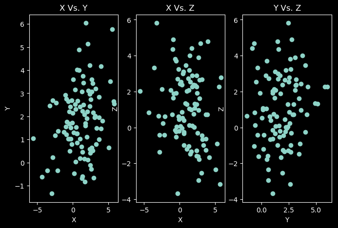

>I notice that in all of these charts, I see the majority of the points are clustered around the mean vector of [1, 2, 1]

## **c.**

I choose the first 5 pairs.
<br> [ x[0], y[0], z[0] ] is matched with [ x[1], y[1], z[1] ]
<br>[ x[2], y[2], z[2] ] is matched with [ x[3], y[3], z[3] ]
<br>and so on until [ x[9], y[9], z[9] ] is matched with [ x[10], y[10], z[10] ]
<br>Also, I added the **Distances** to the **legend**.

```python
a = []
b = []
pat = []
colors = ['red', 'blue', 'green', 'yellow', 'white']
#first chart
fig2 = plt.figure(figsize=plt.figaspect(0.5))
ax2 = fig2.add_subplot(1,2,1, projection='3d')
ax2.scatter(x, y, z) 
ax2.set(xlabel='X', ylabel='Y', zlabel='Z')
#second chart, keep same axes
ax3 = fig2.add_subplot(1,2,2, projection='3d')
ax3.set(xlabel='X', ylabel='Y', zlabel='Z', xlim=(ax2.get_xlim()), ylim=(ax2.get_ylim()), zlim=(ax2.get_zlim()))

#chooses 5 pairs of 2. first 5.
for i in range(0, 10, 2):
    a = np.array((x[i], y[i], z[i]))
    b = np.array((x[i+1], y[i+1], z[i+1]))
    j = int(i/2)
    ax3.scatter(x[i], y[i], z[i], c=colors[j], marker='x')
    ax3.scatter(x[i+1], y[i+1], z[i+1], c=colors[j], marker='x')
    pat.append(Line2D([0], [0], marker='X', color='black', label="Euclidian, Mahalanobis : " +str(round(distance.euclidean(a,b), 1)) + ", " 
    + str(round(distance.mahalanobis(a,b, np.linalg.inv(cov)), 1)) , markerfacecolor= colors[j], markersize=15))

#Legend
lg = ax3.legend(handles = pat, loc = "best", bbox_to_anchor=(1, 1))
#Save, note must have (lg,) inorder to keep the chart in picture.
fig2.savefig("Q02_C.png", format='png', bbox_extra_artists=(lg,), bbox_inches='tight')

```

The output:
<br>
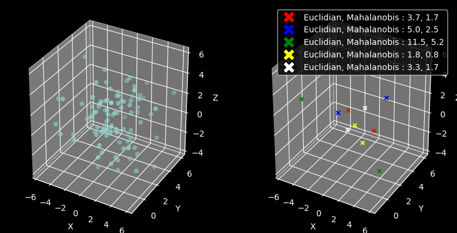

## **Question 3**

### **Reduced Represenatation**

I first did this part manually to learn what was going on the the covariance and eigenvalues/vectors and how to standardize and preform PCA. Then for practical purposes I did it via sklearn.

<br>Code for Reduction of all records with Eigenvalues and Eigenvectors.

```python

x = np.array([[5700, 12.8, 2500, 270, 25000], 
              [1000, 10.9, 600, 10, 10000],
              [3400, 8.8, 1000, 10, 9000],
              [3800, 13.6, 1700, 140, 25000],
              [4000, 12.8, 1600, 140, 25000],
              [8200, 8.3, 2600, 60, 12000],
              [1200, 11.4, 400, 10, 16000],
              [9100, 11.5, 3300, 60, 14000],
              [9900, 12.5, 3400, 180, 18000],
              [9600, 13.7, 3600, 390, 25000],
              [9600, 9.6, 3300, 80, 12000],
              [9400, 11.4, 4000, 100, 13000]])

#Standardize x -> Removes mean from all attributes of x
x = StandardScaler().fit_transform(x)
#covariance
c = np.cov(x.T)
#eigen values / vectors from data
w, v = np.linalg.eig(c)
#print("Eigen Values: " + str(w)+ "\nEigen Vectors: " + str(v))
#initialize pca
pca = PCA(n_components=2)
#do the actual pca
components = pca.fit_transform(x)
xhat = pca.inverse_transform(components)
mse = np.sum((x - xhat) **2)/len(xhat)
#----------First Part---------
colors = ['red', 'blue']
labels = ['Component 1', 'Component 2']

fig, ax = plt.subplots(figsize=(5, 5))
#plot all components on Col 0, and Col 1
ax.plot(components[:,0], components[:,1], 'o')
ax.set(xlabel=labels[0], ylabel=labels[1])
ax.set(title="Reduction Representation")
wv = ""
for i  in range(len(v)):
    wv += str(v[i]) +"\n"
vecs = fig.suptitle("Eigen Values: " + str(w) + "\nEigen Vectors:\n" + wv, fontsize= 12, y = -.01)

fig.savefig("Q03.png",format='png', bbox_extra_artists=(vecs,), bbox_inches='tight')
#---------End First Part---------
```

This code outputs:
<br>
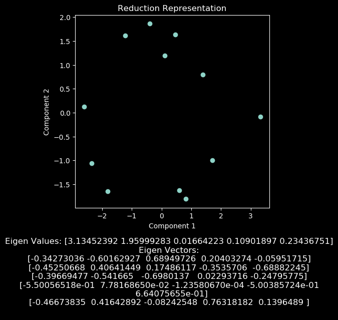

### **Reconstruction of Original Data**

For this section, I followed along the lecture tutorial on PCA Visualization to reconstruct the Data.

```python
#---------Second Part----------
fig2 = plt.figure(figsize=(12,6))
bw = 0.10
r1 = np.arange(len(xhat))
r2 = [x + bw for x in r1]
r3 = [x + bw for x in r2]
r4 = [x + bw for x in r3]
r5 = [x + bw for x in r4]
r6 = [x + bw for x in r5]
colors = ['blue', 'red']

plt.bar(r1, x[:,0], bw, alpha=0.5, color=colors[0], label='Original')
plt.bar(r2, xhat[:,0], bw, alpha=0.5, color=colors[1], label='Rescontructed')
plt.bar(r3, x[:,1], bw, alpha=0.5, color=colors[0])
plt.bar(r4, xhat[:,1], bw, alpha=0.5, color=colors[1])
plt.bar(r5, x[:,2], bw, alpha=0.5, color=colors[0])
plt.bar(r6, xhat[:,2], bw, alpha=0.5, color=colors[1])

plt.xticks([r + bw for r in range(len(xhat))], ['A', 'B', 'C', 'D', 'E', 'F', 'G', 'H', 'I', 'J','K', 'L'])

plt.legend()
fig2.savefig("Q03_Reconstruction.png",format='png')
#---------End Second Part----------
```

This outputs:

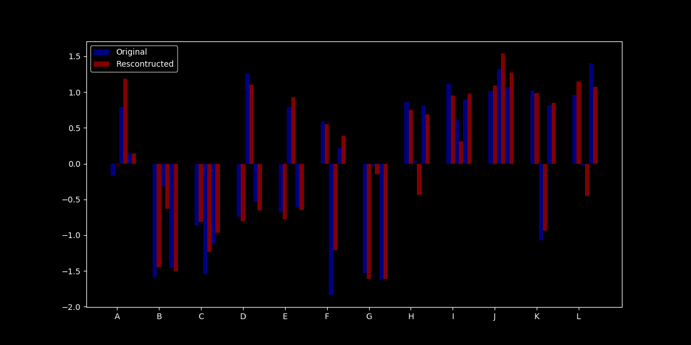

>*NOTE: Since we standardized the data, we got negative values thus the graph has negative values. Resulting in a Recontruction error of 0.33002631291750034*

## **Question 4**

After completing **Question 3**, I was more comfortable with PCA.
First I downloaded the Data from
[Breast Cancer Data] -> in references. I had to import the data using pandas, drop the first and second columns, and then retrieve only the values of the pandas dataframe.

```python
plt.style.use('dark_background')
data = pd.read_csv("wdbc.data", header= None)
#removes id and diagnosis for standardization
num_data = data.drop([data.columns[0], data.columns[1]], axis=1)
num_data = num_data.values
```

I now have to standardize the data, find the covariance matrix, and find the eigenvalues/vectors.

```python
#Standardize x -> Removes mean from all attributes of x
standata = StandardScaler().fit_transform(num_data)
#covariance
c = np.cov(standata.T)
#eigen values / vectors from data
w, v = np.linalg.eig(c)
eigenvals = "Eigen Values: " + str(w)+ "\nEigen Vectors: " + str(v)
```

Now, we can use sklean's fit_transform function to generate our new n x 2 matrix.
Set our target variables to the dropped column of 'M/B' (data[data[1]]). Then just set up the type of chart being plotted.

```python
pca = PCA(n_components=2)
components = pca.fit_transform(standata)
comp_1 = components[:,0]
comp_2 = components[:,1]
target = data[data.columns[1]]
labels = {'M': 'Malignent', 'B': 'Benign'}
colors = {'M': 'lawngreen', 'B': 'deepskyblue'}
marker={'M':'^', 'B': 'o'}
alpha={'M': .3, 'B': .5 }
uniquevals = np.unique(target)
uniquevals = uniquevals[::-1]
fig, ax = plt.subplots(figsize=(7, 5))
for i in uniquevals:
    index = np.where(target == i)
    ax.scatter(comp_1[index], comp_2[index], s=40, label=labels[i], c= colors[i], marker = marker[i], alpha = alpha[i])
plt.legend()
ax.set(title="PCA Breast Cancer", xlabel='First Component', ylabel='Second Component')
fig.savefig("Q04.png",format='png')
```

Output:
<br>
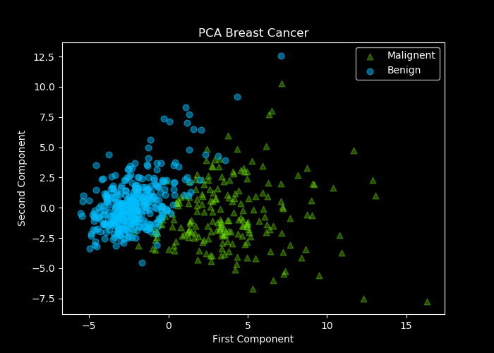

>**Eigenvalues For PCA Breast Cancer**:
<br>
>[1.33049908e+01 5.70137460e+00 2.82291016e+00 1.98412752e+00
 1.65163324e+00 1.20948224e+00 6.76408882e-01 4.77456255e-01
 4.17628782e-01 3.51310875e-01 2.94433153e-01 2.61621161e-01
 2.41782421e-01 1.57286149e-01 9.43006956e-02 8.00034045e-02
 5.95036135e-02 5.27114222e-02 4.95647002e-02 1.33279057e-04
 7.50121413e-04 1.59213600e-03 6.91261258e-03 8.19203712e-03
 1.55085271e-02 1.80867940e-02 2.43836914e-02 2.74877113e-02
 3.12142606e-02 3.00256631e-02]

## **Question 5**

For this problem I followed similar import and data processing as in **Question 4**.

```python
plt.style.use('dark_background')
data = pd.read_csv("wdbc.data", header= None)
#removes id and diagnosis for standardization
num_data = data.drop([data.columns[0], data.columns[1]], axis=1)
num_data = num_data.values
#Standardize x -> Removes mean from all attributes of x
standata = StandardScaler().fit_transform(num_data)
```

Then we set up our t-sne with perplexity of 10 first. Split the result of fit_transform into its two components. My target will be the unique vals in the data[data[1]] column which is the truths values so either M/B. Then plot both M and B values.

```python
tsne = TSNE(n_components=2, verbose=1, perplexity=10, n_iter=2000)
results = tsne.fit_transform(standata)
comp_1 = results[:,0]
comp_2 = results[:,1]
target = data[data.columns[1]]
labels = {'M': 'Malignent', 'B': 'Benign'}
colors = {'M': 'deeppink', 'B': 'yellow'}
marker={'M':'^', 'B': 'o'}
alpha={'M': .3, 'B': .5 }
uniquevals = np.unique(target)
uniquevals = uniquevals[::-1]
fig, ax = plt.subplots(figsize=(5, 5))
for i in uniquevals:
    index = np.where(target == i)
    ax.scatter(comp_1[index], comp_2[index], s=40, label=labels[i], c= colors[i], marker = marker[i], alpha = alpha[i])
plt.legend()
ax.set(title="TSNE Breast Cancer\n*Perplexity 10", xlabel='First Component', ylabel='Second Component')
fig.savefig("Q05_per10.png",format='png')
```

This outputs:
<br>
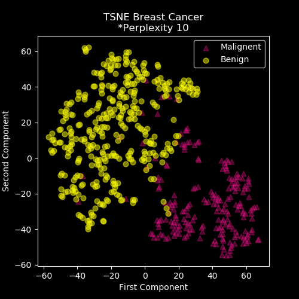

Similarily we can do this for any perplexity. So for perplexity=50 we'd just do:

```python
tsne = TSNE(n_components=2, verbose=1, perplexity=50, n_iter=2000)
results = tsne.fit_transform(standata)
comp_1 = results[:,0]
comp_2 = results[:,1]
target = data[data.columns[1]]
labels = {'M': 'Malignent', 'B': 'Benign'}
colors = {'M': 'deeppink', 'B': 'yellow'}
marker={'M':'^', 'B': 'o'}
alpha={'M': .3, 'B': .5 }
uniquevals = np.unique(target)
uniquevals = uniquevals[::-1]
fig, ax = plt.subplots(figsize=(5, 5))
for i in uniquevals:
    index = np.where(target == i)
    ax.scatter(comp_1[index], comp_2[index], s=40, label=labels[i], c= colors[i], marker = marker[i], alpha = alpha[i])
plt.legend()
ax.set(title="TSNE Breast Cancer\n*Perplexity 50", xlabel='First Component', ylabel='Second Component')
fig.savefig("Q05_per50.png",format='png')
```

This will output:
<br>

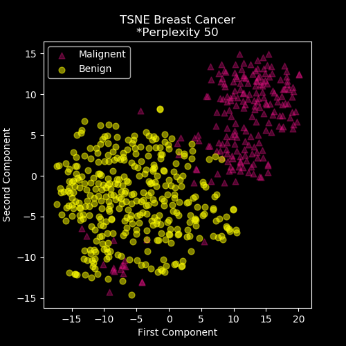

>One important feature I obtained from the results is that when perplexity increases the points become more clustered together. This might be easier to visualize but we loose uniqueness. When we used perplexity=10 we see that they are more spread out and very little overlap. When it was set to 50, we can see that Malignent points were all the way down in the negatives mixing with Benign values.

## **References**

> ### **Data**
>
>* [Census Income Data Set](https://archive.ics.uci.edu/ml/datasets/Census+Incomeml/datasets/Census+Income)
>* [Breast Cancer Data Set](https://archive.ics.uci.edu/ml/datasets/Breast+Cancer+Wisconsin+%28Diagnostic%29)

### **Tutorials Read**

>* [From Data To Decision](https://iksinc.online/2018/08/21/principal-component-analysis-pca-explained-with-examples/)
