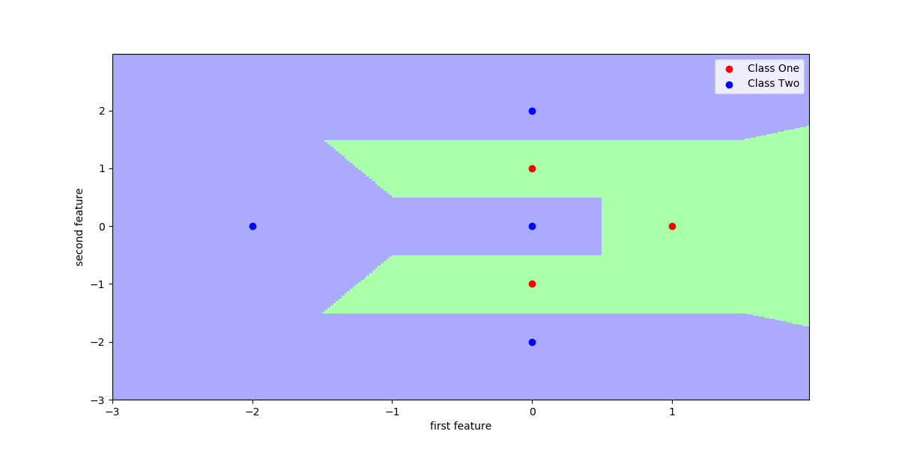
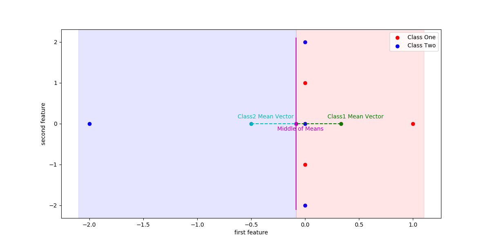

<p align = "right"> <font size='3'> Adrian Sandoval-Vargas</font></p>
<p align = "right"> <font size='3'>CSI 5810 Assignment 2 </font></p>

<h1></h1>

Through this assignment I re-read all lecture matrial to further understand the content. I did do some research on how to calculate the minimum distance classifier since it wasn't mentioned in the lecture slides. Which was simply the median distance between the mean of the samples **('Other Material')**. I did not do any major calculations by code as sklearn contains functions that do it for example the Guassian Naive_Bayes_Classifier algorithm was developed by Standford University alumni/professors. So I trust them. Besides that I referenced in class material.

### **Question 1**

<pre>
Equations & Variables
rR = Retrieved Relevant
tret = Total retrieved
trel = Total relevant
1. percision = rR / tret
2. recall =  rR / trel
</pre>

#### **a.**

We know that **Precision** is the fraction of retrieved documents that are relevant and **Recall** is the fraction of relevant documents that are retrieved we can use the above equations.

When we are determining **Precision**, if we increase the **tret** documents (10 to 20) and assuming that **rR** stayed the same then precision will decrease. Inversely, if we decrease the **tret** documents and **rR** stayed the same the Precision will increase. Thus precision is dependent on the **total number of documents retrieved** and the **total relevant retrieved documents**. Precision will almost always change if we decrease or increase the total number of documents we retrieve - Except for the case where **rR** increases/decreases proportionally to the intial ratio.
So if increase (10 to 20) and the **rR** changes, precision will change if and only if **rR** changes proportionally to the intial amount. Now **Recall** is dependent on the total number of **rR** documents and **trel** documents. What this means is that if the **rR** does not change based on the query (**trel** value remains the same) thus, no matter what we do to **tret** Recall will remain unchanged. If in the event where **rR** changes, **trel** will change and the Recall will change. So if we increase (10 to 20) and **rR** changes, then Recall will increase.

In conclusion, the value for Precision will almost always change except for when **rR** increases to give the same ratio as the initial one. The value for Recall will only change if and only if **rR** because **trel** is a fixed number. **So, to clarify the answer to this question, By increasing the number of retrieved documents from 10 to 20 Precision and Recall will more than likely change.**

#### **b.**

<pre>
Given: System Retrieves 20 Documents, Precision = 80%, Recall = 50%
</pre>

First we have to find the relavant documents from the retrieved ones. For this we will use equation 1:
<pre>
.8 = rR / 20 => solving for rR = 16 relevant documetns.
</pre>

We can then figure out the how many relevant documetns there are in the collection by using equation 2:
<pre>
.5 = 16 / tRel => tRel = 32 total relevant doucments.
</pre>

Since we have a total of **32** total relevant documents and the query returned **16** relevant documents there is **(32 -16) = 16** remaining documents that the system did not retrieve.

### **Question 2**

For this question I referenced __IRIntro__ lecture slide to get a grasp on how to do the text processing in python. Code is the reference **(C2)**. Our boolean matrix obtained looks something like:
||7oldsamr.txt|alissadl.txt|aminegg.txt|bestwish.txt|burn.txt|crabhern.txt|mydream.txt|narciss.txt|
|------------|-----|-----|-----|-----|-----|-----|-----|-----|
|abilities   |0    |0    |0    |0    |1    |0    |0    |0    |
|ability     |0    |1    |0    |0    |0    |0    |0    |0    |
|able        |0    |0    |0    |0    |1    |0    |0    |0    |
| ...        |
|years       |1    |0    |3    |0    |1    |0    |0    |0    |
|young       |1    |0    |0    |0    |0    |0    |0    |1    |
|youth       |0    |0    |0    |0    |1    |0    |0    |0    |

>Note: This matrix has integers beyond 1's and 0's

To calculate the similarity I used **[matplotlib.pyplot.jaccards_score](https://scikit-learn.org/stable/modules/generated/sklearn.metrics.jaccard_score.html#sklearn.metrics.jaccard_score)**. I played around with the average parameter and found out that 'micro' and 'weighted' gave me pretty similary results. I went along with weighted since it found the average of each label and weighted them by the number of true instances. I then rounded the dataframe to 5 decimal places if applicable. I got the following result:

|      |7oldsamr.txt|alissadl.txt|aminegg.txt|bestwish.txt|burn.txt|crabhern.txt|mydream.txt|narciss.txt|
|------------|------------|------------|-----------|------------|--------|------------|-----------|-----------|
|7oldsamr.txt|1.0         |0.54624     |0.56236    |0.57272     |0.5442  |0.56024     |0.54078    |0.58473    |
|alissadl.txt|0.56119     |1.0         |0.60547    |0.6113      |0.56426 |0.59307     |0.58112    |0.62564    |
|aminegg.txt |0.58986     |0.61698     |1.0        |0.63254     |0.60057 |0.63303     |0.60214    |0.64407    |
|bestwish.txt|0.61387     |0.63722     |0.64657    |1.0         |0.64293 |0.64686     |0.64606    |0.67912    |
|burn.txt    |0.56156     |0.56678     |0.5914     |0.61987     |1.0     |0.57803     |0.57107    |0.61854    |
|crabhern.txt|0.57944     |0.59709     |0.62525    |0.62457     |0.57963 |1.0         |0.59701    |0.62611    |
|mydream.txt |0.55763     |0.58337     |0.59217    |0.62167     |0.57107 |0.59462     |1.0        |0.62422    |
|narciss.txt |0.6398      |0.66558     |0.67285    |0.69357     |0.65656 |0.66274     |0.66234    |1.0        |

### **Question 3**

**Code In Reference (C3)**

In conjuction with question 2 use vector space representation and we'll recieve a matrix looking something like (this was also rounded to 5 decimals places):
|     |7oldsamr.txt|alissadl.txt|aminegg.txt|bestwish.txt|burn.txt|crabhern.txt|mydream.txt|narciss.txt|
|------------|------------|------------|-----------|------------|--------|------------|-----------|-----------|
|abilities   |0.0         |0.0         |0.0        |0.0         |0.05475 |0.0         |0.0        |0.0        |
|ability     |0.0         |0.04925     |0.0        |0.0         |0.0     |0.0         |0.0        |0.0        |
|able        |0.0         |0.0         |0.0        |0.0         |0.05475 |0.0         |0.0        |0.0        |
|...|
|years       |0.03615     |0.0         |0.11546    |0.0         |0.0396  |0.0         |0.0        |0.0        |
|young       |0.04189     |0.0         |0.0        |0.0         |0.0     |0.0         |0.0        |0.0607     |
|youth       |0.0         |0.0         |0.0        |0.0         |0.05475 |0.0         |0.0        |0.0        |


And to find the cosine similarity (how close doc to another doc based on angle) I used [sklear.metrics.pairwise.cosine_similarity](https://scikit-learn.org/stable/modules/generated/sklearn.metrics.pairwise.cosine_similarity.html) as mentioned in the example. This gives us:

|      |7oldsamr.txt|alissadl.txt|aminegg.txt|bestwish.txt|burn.txt|crabhern.txt|mydream.txt|narciss.txt|
|------------|------------|------------|-----------|------------|--------|------------|-----------|-----------|
|7oldsamr.txt|1.0         |0.02785     |0.07092    |0.03226     |0.01389 |0.06087     |0.03055    |0.03074    |
|alissadl.txt|0.02785     |1.0         |0.03104    |0.05648     |0.016   |0.02828     |0.02529    |0.02991    |
|aminegg.txt |0.07092     |0.03104     |1.0        |0.01495     |0.01315 |0.03428     |0.01277    |0.01837    |
|bestwish.txt|0.03226     |0.05648     |0.01495    |1.0         |0.07822 |0.08026     |0.09517    |0.03547    |
|burn.txt    |0.01389     |0.016       |0.01315    |0.07822     |1.0     |0.0113      |0.02582    |0.01671    |
|crabhern.txt|0.06087     |0.02828     |0.03428    |0.08026     |0.0113  |1.0         |0.03062    |0.01618    |
|mydream.txt |0.03055     |0.02529     |0.01277    |0.09517     |0.02582 |0.03062     |1.0        |0.01374    |
|narciss.txt |0.03074     |0.02991     |0.01837    |0.03547     |0.01671 |0.01618     |0.01374    |1.0        |

### **Question 4**

#### **i.**

**Code in Reference (C4.i)**

For this problem I referenced the example of K-NN to draw the boundaries after I separated the two classes.



### **ii.**

**Code in Reference (C4.ii)**

I got the mean vector from both classes. Then I plotted the points. To find the minimun distance decision boundary one could
1. Use the Euclidian distance between two points divide by two and then add to left most point ond subtract to the right most point. Then plot.
2. Use the midway formula which is (x1 + x2)/2  (y1 + y2)/2 then plot.

Since we are comparing two classes and the dataset is small, I went with option 2. I then generated the boundary line orthogonal to the found locus.



### **Question 5**

**Code in Reference (C5)**

For this question I basically parsed out all the data into it's respective features and classes. I then used sklearns libraries to compute the K-NN (k = 1,3,5) and Naive Bayes Classifiers. The Results obtained are metioned below (prediction ->[x]).

|  Classifier    |Test 1            |Test 2            |Test 3            |Accuracy|
|------|------------------|------------------|------------------|------------|
| 1NN |Test 1 Result [3] |Test 2 Result [2] |Test 3 Result [3] |1.00  |
| 3NN |Test 1 Result [3] |Test 2 Result [2] |Test 3 Result [3] |0.96  |
| 5NN |Test 1 Result [3] |Test 2 Result [2] |Test 3 Result [3] |0.98  |
| Naive Bayes |Test 1 Result [3]|Test 2 Result [2]  |Test 3 Result [3] |0.96  |


>###  __**References**__
>>__**(C2):**__
>>``` python
>>import numpy as np
>>import nltk
>>import pandas as pd
>>from nltk.corpus.reader import PlaintextCorpusReader
>>from sklearn.feature_extraction.text import CountVectorizer
>>mycorpus = PlaintextCorpusReader(r"CSI58100TextFiles", r".*\.txt")
>>vec = CountVectorizer()
>>indx = 0
>>lst = []
>>for i in mycorpus.fileids():
>>    nlst = mycorpus.raw(i)
>>    indx = indx+1
>>    lst.append(nlst)
>>corpus = np.array(lst)
>>
>>#-----------Stop Words---------
>>vec = CountVectorizer(stop_words="english")
>>vec.fit(corpus)
>>#Sparse matrix
>>X = vec.transform(corpus)
>>
>># Jaccards similarity
>>from sklearn.metrics import jaccard_score
>>similarity = []
>>for i in range(0, len(X.toarray())):
>>    matrix = []
>>    for k in range(0, len(X.toarray())):
>>        matrix.append(jaccard_score( X.toarray()[i], X.toarray()[k], average ='micro')) # Calculate metrics for each label, and find their average, weighted by support (the number of true instances for each label).
>>        if(k == 7):
>>            similarity.append(matrix)
>>
>>df = pd.DataFrame(similarity, columns = mycorpus.fileids(), index = mycorpus.fileids())
>>df = df.round(3) #round values to 3 decimal places
>>print(df)
>>df.to_csv('sample.csv')
>>```
>>
>>__**(C3):**__
>> ``` python
>>import numpy as np
>>import nltk
>>import pandas as pd
>>from nltk.corpus.reader import PlaintextCorpusReader
>>from sklearn.feature_extraction.text import CountVectorizer
>>mycorpus = PlaintextCorpusReader(r"CSI58100TextFiles", r".*\.txt")
>>vec = CountVectorizer()
>>indx = 0
>>lst = []
>>for i in mycorpus.fileids():
>>    nlst = mycorpus.raw(i)
>>    indx = indx+1
>>    lst.append(nlst)
>>corpus = np.array(lst)
>>
>>#-----------Stop Words---------
>>vec = CountVectorizer(stop_words="english")
>>vec.fit(corpus)
>>#Sparse matrix
>>X = vec.transform(corpus)
>>#tfidf
>>from sklearn.feature_extraction.text import TfidfTransformer
>>tfidf = TfidfTransformer()
>>xTfidf = tfidf.fit_transform(X)
>>df_tfidf = pd.DataFrame(xTfidf.toarray(), columns = vec.get_feature_names(), index = mycorpus.fileids()).T
>>df_tfidf = df_tfidf.round(5)
>>df_tfidf.to_csv('tfidfMatrix.csv')
>># Cosine similarity
>>from sklearn.metrics.pairwise import cosine_similarity
>>similarity = cosine_similarity(xTfidf,xTfidf)
>>print(similarity)
>>
>>df = pd.DataFrame(similarity, columns = mycorpus.fileids(), index = mycorpus.fileids())
>>df = df.round(5)
>>df.to_csv('sample_Q3.csv')
>>```
>>
>>__**(C4.i):**__
>>``` python
>>import matplotlib.pyplot as plt
>>import numpy as np
>>from sklearn.datasets import make_blobs
>>
>>#X, y = make_blobs(n_samples= 10, centers= 2, cluster_std= 4.0, random_state=10)
>>from matplotlib.colors import ListedColormap
>>cmap_light = ListedColormap(["#AAFFAA", "#AAAAFF"])
>>
>>from sklearn.neighbors import KNeighborsClassifier
>>from sklearn.model_selection import train_test_split
>>X = np.array([[1,0],  [0, 1], [0, -1], [0, 0], [0, 2], [0, -2], [-2, 0]])
>>elements = [0, 0, 0, 1, 1, 1, 1]
>>class_one = np.array([[1,0],  [0, 1], [0, -1]])
>>class_two = np.array([[0, 0], [0, 2], [0, -2], [-2, 0]])
>>#i
>>k_value = 1
>>knn = KNeighborsClassifier(k_value)
>>knn.fit(X, elements)
>>x_min, x_max = X[:, 0].min() - 1, X[:,0].max() + 1
>>y_min, y_max = X[:, 1].min() - 1, X[:, 1].max() + 1
>>xx, yy = np.meshgrid(np.arange(x_min, x_max, 0.02), np.arange(y_min, y_max, 0.02))
>>Z = knn.predict(np.c_[xx.ravel(), yy.ravel()])
>>Z = Z.reshape(xx.shape)
>>fig = plt.figure(figsize=(12,6))
>>plt.pcolor(xx, yy, Z, cmap=cmap_light)
>>plt.scatter(class_one[:,0], class_one[:,1], c="r", label='Class One')
>>plt.scatter(class_two[:,0], class_two[:,1], c="b", label='Class Two')
>>plt.xlabel("first feature")
>>plt.ylabel("second feature")
>>#print("accuracy: {:.2f}".format(knn.score(X, elements)))
>>plt.legend()
>>plt.show()
>>fig.savefig("Q4_i.png", format='png')
>>```
>>
>>__**(C4.ii):**__
>>```python
>>import matplotlib.pyplot as plt
>>import numpy as np
>>X = np.array([[1,0],  [0, 1], [0, -1], [0, 0], [0, 2], [0, -2], [-2, 0]])
>>elements = [0, 0, 0, 1, 1, 1, 1]
>>class_one = np.array([[1,0],  [0, 1], [0, -1]])
>>class_two = np.array([[0, 0], [0, 2], [0, -2], [-2, 0]])
>>classOne_vector = [class_one[:, 0].mean(), class_one[:, 1].mean()]
>>classTwo_vector = [class_two[:, 0].mean(), class_two[:, 1].mean()]
>>dis = (classOne_vector[0] + classTwo_vector[0])/2
>>middle = [dis, 0]
>>print(dis)
>>print(classOne_vector)
>>print(classTwo_vector)
>>fig = plt.figure(figsize=(12,6))
>>plt.scatter(class_one[:,0], class_one[:,1], c="r", label='Class One')
>>plt.scatter(class_two[:,0], class_two[:,1], c="b", label='Class Two')
>>plt.scatter(middle[0], middle[1], color='m')
>>plt.text(middle[0]-.175, middle[1]-.175, "Middle of Means", color='m')
>>plt.scatter(classOne_vector[0], classOne_vector[1], c='g' )
>>plt.plot([classOne_vector[0], middle[0]], [0, 0],'g--')
>>plt.text(classOne_vector[0]-.125, classOne_vector[1]+.125, "Class1 Mean Vector", color='g')
>>plt.scatter(classTwo_vector[0], classTwo_vector[1], c='c')
>>plt.text(classTwo_vector[0]-.125, classTwo_vector[1]+.125, "Class2 Mean Vector", color='c')
>>plt.plot([classTwo_vector[0], middle[0]], [0, 0],'c--')
>>plt.plot([middle[0], middle[0]], [-2.1, 2.1],'m-')
>>plt.axvspan(middle[0], 1.1, color ='r', alpha=.1)
>>plt.axvspan(middle[0], -2.1, color ='b', alpha=.1)
>>plt.xlabel("first feature")
>>plt.ylabel("second feature")
>>plt.legend()
>>plt.show()
>>fig.savefig("Q4_ii.png", format='png')
>>```
>>
>>__**(C5):**__
>>```python
>>import numpy as np
>>import pandas as pd
>>from sklearn.neighbors import KNeighborsClassifier
>>from sklearn.naive_bayes import GaussianNB
>>
>>#Data post processing
>>wd = pd.read_excel('Wheat_Data.xlsx')
>>
>>feature_class = []
>>wd_arr = np.array(wd)
>>features = [i for i in wd_arr[0:96][:,:-1]]
>>feature_class = [i for i in wd_arr[:-4,7]] 
>>classOne = wd_arr[0:32]
>>classTwo = wd_arr[32:64]
>>classThree = wd_arr[64:96]
>>testData = [wd_arr[97:98][:,:-1], wd_arr[98:99][:,:-1], wd_arr[99:100][:,:-1] ]
>>predictions = []
>>
>>#1-NN
>>knn1 = KNeighborsClassifier(1)
>>knn1.fit(features, feature_class)
>>knn1Pre = []
>>for x in range(0, len(testData)):
>>    knn1Pre.append("1NN Test "+ str(x+1) + " Result {}".format(knn1.predict(testData[x])))
>>
>>knn1Pre.append(" Accuracy: {:.2f}".format(knn1.score(features, feature_class)))
>>
>>predictions.append(knn1Pre)
>>
>>#3-NN
>>knn3 = KNeighborsClassifier(3)
>>knn3.fit(features, feature_class)
>>knn3Pre = []
>>for x in range(0, len(testData)):
>>    knn3Pre.append("3NN Test "+ str(x+1) + " Result {}".format(knn3.predict(testData[x])))
>>
>>knn3Pre.append("Accuracy: {:.2f}".format(knn3.score(features, feature_class)))
>>
>>predictions.append(knn3Pre)
>>
>>#5-NN
>>knn5 = KNeighborsClassifier(5)
>>knn5.fit(features, feature_class)
>>knn5Pre = []
>>
>>for x in range(0, len(testData)):
>>    knn5Pre.append("5NN Test "+ str(x+1) + " Result {}".format(knn5.predict(testData[x])))
>>
>>knn5Pre.append("Accuracy: {:.2f}".format(knn5.score(features, feature_class)))
>>
>>predictions.append(knn5Pre)
>>
>>nbc = GaussianNB()
>>nbc.fit(features, feature_class)
>>for x in range(0, len(testData)):
>>    #knn5Pre.append("5NN Test "+ str(x+1) + " Result {}".format(knn5.predict(testData[x])))
>>    print(nbc.predict(testData[x]))
>>
>>print(nbc.score(features, feature_class))
>>```
>
> ## **Other Material**
>
>* [Minimum Distance Boundary](https://www.ics.uci.edu/~rickl/courses/cs-171/2013-fq-cs171/2013-fq-cs171-lecture-slides/2013fq171-19-LearnClassifiers.ppt)
>
> ## **Documentation**
>* [matplotlib.metrics.jaccards_score](https://scikit-learn.org/stable/modules/generated/sklearn.metrics.jaccard_score.html#sklearn.metrics.jaccard_score)
>
>* [sklear.metrics.pairwise.consine_similarity](https://scikit-learn.org/stable/modules/generated/sklearn.metrics.pairwise.cosine_similarity.html)
>* [sklearn.naive_bayes](https://scikit-learn.org/stable/modules/generated/sklearn.naive_bayes.GaussianNB.html) for details on algorithm visit -> [STAN-CS-79-773](http://i.stanford.edu/pub/cstr/reports/cs/tr/79/773/CS-TR-79-773.pdf)
>* [sklearn.neighbors](https://scikit-learn.org/stable/modules/generated/sklearn.neighbors.KNeighborsClassifier.html#sklearn.neighbors.KNeighborsClassifier)