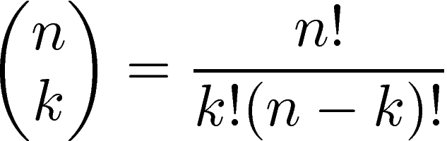

<p align = "right"> <font size='3'> Adrian Sandoval-Vargas</font></p>
<p align = "right"> <font size='3'>CSI 5810 Assignment 3 </font></p>

<h1></h1>

## Question 1

For this question I looked at the Perceptron Lerning Rule to apply to my script. Since the Perctron has two functions

1. Calculate the Weighted Sum.
2. Produce the output.

I created two functions that correspond to each of the functions above.

Running the script:

|Iteration|Weight|
|------------|-----|-----|
| 1  |[1. 1. 1.]    |
| 2  |[-1.  0. -1.]  |
| 3  |[-1.  1. -4.]  |
| 4  |[-1.  1. -4.]  |
| 5  |[-1.  1. -4.]  |

The Percentron then gave the output:

|OUTPUT|
|------------|
|[-1.  1. -4.] |

## Question 2

For this question we will be using the Majority Rule or more fundamentaly in math the Binomial Distribution. Which states that the Probability where **X** is eqaul to **x** given a probability **p** and some quantity of **n** samples is equal to: 

P(X = x | p, n) = ( n! / r! ( n - x ) ) ( p<sup>x</sup> ( 1 - p )<sup>n - x</sup> )
<br></br>

Where **X** is the set of all testing learners and **x** is one of the learners.

This can be futher expressed in statistical form as
P(X = x | p, n) = (nCr) ( p<sup>x</sup> ( 1 - p )<sup>n - x</sup> ) Where **nCr**  Means 'n Choose r' which is just the binomial coefficient or the 'combinations' of n choosing a value r.



<pre>We are given that p = 55% = .55
and we have 7 learners = n
</pre>

To calculate the accuracy of the ensemble, we will need to calculate the summation of the probabilities of **x**.
So by applying the binomial distribution for the first iteration:

<br></br>

| n | nCr | p<sup>x</sup> | ( 1 - p )<sup>n - x</sup>  | P(X = x \ n, p) |
|------------|-----|-----| -----|-----|----|
| 1  |  7C1 => 7   | .55 <sup>1</sup> => 0.55 | (1 - .55)<sup>7 - 1</sup> => (.45)<sup>6</sup> => 0.008303766 | 0.031969499|
| 2  |  7C2 => 21  | .55 <sup>2</sup> => 0.3025 | (1 - .55)<sup>7 - 2</sup> => (.45)<sup>5</sup> => 0.018452813 | 0.1172214946|
| 3  |  7C3 => 35  | .55 <sup>3</sup> => 0.166375 | (1 - .55)<sup>7 - 3</sup> => (.45)<sup>4</sup> => 0.04100625 | 0.2387845195|
| 4  |  7C4 => 35  | .55 <sup>4</sup> => 0.09150625 | (1 - .55)<sup>7 - 4</sup> => (.45)<sup>3</sup> => 0.091125 | 0.2918477461|
| 5  |  7C5 => 21  | .55 <sup>5</sup> => 0.050328438 | (1 - .55)<sup>7 - 5</sup> => (.45)<sup>2</sup> => 0.2025 | 0.2140216826|
| 6  |  7C6 => 7   | .55 <sup>6</sup> => 0.027680641 | (1 - .55)<sup>7 - 6</sup> => (.45)<sup>1</sup> => 0.45 | 0.0871940192|
| 7  |  7C7 => 1   | .55 <sup>7</sup> => 0.015224352 | (1 - .55)<sup>7 - 7</sup> => (.45)<sup>0</sup> => 1 | 0.015224352|

Resulting with an **accuracy** of **.608 = 60.8%** When P(X > 3) == P(X >= 4)

To find the minimum learners to achieve 90% accuracy we can run the binomial distribution function until we reach an n value where the result equal 90%. 
The amount of learners needed to achieve 90% is: **163 Learners.**

## Question 3

The Fisher's linear discriminant function is in the code.

C1 Projection: -0.647594985288474

C2 Projection: -2.6790008954842017

Determination of [3,3] Class Label: -1.201995650505309

Z-cut: -1.663297940386338

So the predicted value is: **Class One.**

## Question 4

GINI Value for **Color**:

Red = 3/6 | Blue = 1/6 | Green = 2/6

Red and + = 2/3, Red and - = 1/3, Blue and + = 1/1, Green and - = 2/2

G(red) = 1 - [ (2/3)<sup>2</sup>+(1/3)<sup>2</sup> ]= 1 - (11/18) = **0.388**

G(blue) = 1 - (1<sup>2</sup> + 0<sup>2</sup>) = **0**

G(green) = 1 - (0<sup>2</sup> + 1<sup>2</sup>) = **0**

weighted_gini(Color) = ((3/6) * .388) + ((1/6) * 0 )+ ((2/6) * 0 ) = **0.0277**

GINI Value for **Shape**:

Square = 4/6 | Round = 2/6 

Square and + = 2/4, Square and - = 2/4, Round and + = 1/2, Round and - = 1/2

G(square) = 1 - [ (2/4)<sup>2</sup>+(2/4)<sup>2</sup> ]= 1 - (1/2) = **0.50**

G(round) = 1 - [(1/2)<sup>2</sup> + (1/2)<sup>2</sup>] = **.5**

weighted_gini(Shape) = ((4/6) * .5) + ((2/6) * .5 )) = **0.5**

GINI Value for **Size**:

Big = 4/6 | Small = 2/6

Big and + = 3/4, Big and - = 1/4, Small and - = 2/2

G(big) = 1 - [ (3/4)<sup>2</sup>+(1/4)<sup>2</sup> ]= **0.3750**

G(samll) = 1 - [1<sup>2</sup> + 1<sup>2</sup>] = **1**

weighted_gini(size) = ((4/6) * 0.3750) + ((2/6) * 1 )) = **0.5833**

**So are best attribute for the root is SIZE**

## Question 5


## Reference's

### Q1 Code:

``` python
import numpy as np
import matplotlib as plt


data = np.array([[2,2,-1], [3,5,-1], [1,3,-1], [-1, -0.5, -1]]) #Given Class 1 and Class 2
classes = np.array([1,1,2,2]) #Classes  
aug_vec = np.array([1,1,1]) #weights
d = 4 #how deep the summation will go

#Perceptron that takes in the two classes data and the classes map

print(aug_vec)
def perceptron(input, class_label, to_d):
    global aug_vec
    if to_d == 0:
        print('OUTPUT: ')
        print(aug_vec)
    else:
        cal_weight(input, class_label)
        to_d -= 1
        perceptron(input, class_label, to_d)  

#Calculates the weight
def cal_weight(dt, labels):
    global aug_vec
    if dt.size == 0:
        print(aug_vec)
    else:
        if ((np.dot(dt[0], aug_vec))* labels[0]) <= 0:
            aug_vec = aug_vec + (dt[0] * labels[0])
        cal_weight(dt[1:], labels[1:])

#calls the perceptron with overloaded parameters
perceptron(data, classes, d)

```

## Question 2 Code

```python
from scipy.stats import binom
import numpy as np

#Find learners
found = False
accuracy = 0
learners = 7 + 1
 
while not found:
    i = learners/2
    if( 1 - binom.cdf(i, learners, .55)) >= .9:
        found = True
        accuracy = (1 - binom.cdf(i, learners, .55))
    else:
        learners += 1


```

## Question 3 Code

```python
import numpy as np

#class vectors
c1 = np.array([[2,10], [2,5], [1,2], [4,9]])
c2 = np.array([[8,4], [5,8], [7,5], [6,4]])
test = [3,3]
#means
c1_mean = np.mean(c1, 0)
c2_mean = np.mean(c2, 0)

#matrix
c1_mat = 3 * np.cov(c1.T)
c2_mat = 3 * np.cov(c2.T)

mat = c1_mat + c2_mat

mat_inv = np.linalg.inv(mat)

#weight vector

weight_vec = np.matmul(mat_inv, (c1_mean - c2_mean))

#mat mult to get classification
c1_pro = np.matmul(weight_vec.T, c1_mean)
c2_pro = np.matmul(weight_vec.T, c2_mean)

#cut in half
z = .5 * (c1_pro + c2_pro)

print("C1 Projection: {}".format(c1_pro))
print("C2 Projection: {}".format(c2_pro))
var = np.matmul(weight_vec.T, test)
print("Determination of [3,3] Class Label: {}".format(var))
print("Z-cut: {}".format(z) )
print("So the predicted value is: Class One.")
```
