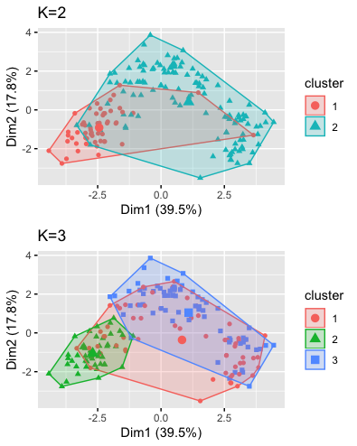
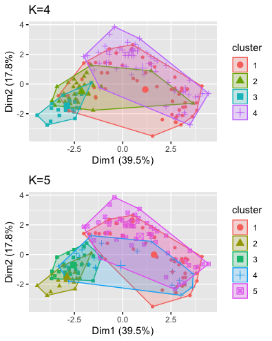
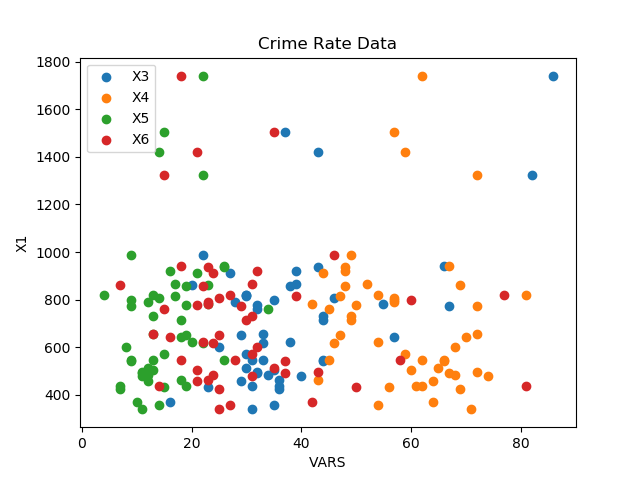
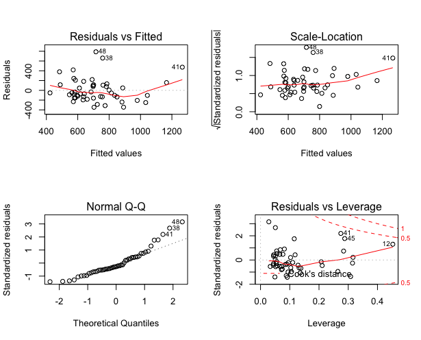

<p align = "right"> <font size='3'> Adrian Sandoval-Vargas</font></p>
<p align = "right"> <font size='3'>CSI 5810 Assignment 4 </font></p>

<h1></h1>

## **Question 1**

For this problem I used the language R. I wasn't sure were to find the wine dataset mentioned so I assumed and used the Wine Dataset found in the UCI Machine Learning database.

>
><div style="display:flex">
>     <div style="flex:1;padding-right:5px;">
>          
>     </div>
>     <div style="flex:1;padding-left:5px;">
>          
>     </div>
></div>
>
>Figures of K-means clustering on Wine Dataset.

The SSE and Rand Index are as follows:

||K2|K3|K4|K5|
|--|--|--|--|--|
|SSE|4543801.2|2370742.3|1331953.8|916424.2|
|Rand Index|0.6702850|0.7186568|0.7002476|0.7164984|

## **Question 2**

Since X1 is our target values, then we do not need X2.
Data:



After building the linear model and reading the summary:

``` r
target = CrimeRate$X1
vars = as.matrix(CrimeRate[,3:7])
lm1 <- lm(target ~ vars)
summary(lm1)
```

We obtain:
||Estimate| Std.Error| tvalue| Pr(>abs(t))|
|--|--|--|--|--|
|(Intercept)|  489.649 |   472.366 |  1.037 |0.305592
varsX3|        10.981|      3.078  | 3.568 |0.000884
varsX4|        -6.088 |     6.544 | -0.930 |0.357219
varsX5|         5.480 |    10.053  | 0.545| 0.588428
varsX6|         0.377 |     4.417 |  0.085 |0.932367
varsX7|        5.500 |    13.754 |  0.400 |0.691150

This model gives us something like:



Using are Intercept and Betas 'Estimates' from our table above. This model gives us:

```math
X1 = 489.65 + (10.98 * X3) - (6.09 * X4) + (5.48 * X5) + (0.38 * X6) + (5.50 * X7)
```

With a Multiple R-squared of: 0.3336 which translates to 33% accuracy. Which is not what we want.

So lets do gradient descent on each attribute( X3, X4, X5, X6, X7)

X3:
```python
data = pd.read_excel("CrimeRate.xlsx")
X3 = data['X3']
N = 50
alpha = 1.3
w = np.random.randn(50)
l_rate = 15
result = []
loss = 0
for t in range(5):
    y_pred = X3.dot(w)
    loss = np.square(y_pred - Y)
    if t % 10 == 0:
        print("t: " + str(t) +" loss " + str(loss))
        result.append(loss)
    grad_y_pred = 2.0 * (y_pred - Y)
    grad_w = X3.T.dot(grad_y_pred)
    w -= l_rate * grad_w

print(w)
```

X3:

Learning Rate 15 yields: a weight of 8.056

Learning Rate 10 yields: a weight of 8.163

Similarly we can do the same with the other attributes.

X4:

Learning Rate 15 yields: a weight of 5.34

Learning Rate 10 yields: a weight of 4.415

X5:

Learning Rate 10 yields: a weight of 2.201

Learning Rate 15 yields: a weight of 1.458

X6:

Learning Rate 15 yields: a weight of 4.192

Learning Rate 10 yields: a weight of 5.995

X7:

Learning Rate 10 yields: a weight of 8.794

Learning Rate 15 yields: a weight of 6.597

This results in a new model of

```math
X1 = 489.65 + (8.056 * X3) + (5.34 * X4) + (1.458* X5) + (4.192 * X6) + (6.597 * X7)
```

## **Question 3**

Decomposition of minimum support threshold of 30%:

Item | Frequency | Support %
--|-- | --
A | 5 |  50%
B | 7 |  70%
C | 5 |  50%
D | 9 |  90%
E | 6 |  60%

Threshold of the combinations of the TID:

Item | Frequency | Support %
--|-- | --
AB | 3 | 30%
<del>AC | <del>2 | <del>20%
AD | 4 | 40%
AE | 4 | 40%
BC | 3 | 30%
BD  | 6  |  60%
BE  | 4  |  40%
CD  | 4  |  40%
<del>CE</del>  | <del>2</del>  |  <del>20%</del>
DE  | 6  |  60%

Since AC and CE are below 30% we can remove.

Now that we have our singular and 2 combinations above the 30% threshold we can look into the three items that have an occurance of 30%:

Item | Frequency | Support %
--|--|--
<del>ABD | <del>2 | <del>20%
<del>ABE  | <del>2 | <del>20%
ADE   | 4  | 40%
<del>BCD   | <del>2  | <del>20%
<del>BCE   | <del>1  | <del>10%
BDE   | 3  | 30%

Again removing the items that below 30% gives us:

Item | Frequency | Support %
--|--|--
ADE   | 4  | 40%
BDE   | 3  | 30%

So ADE and BDE are the most frequent subsets that are at par or greater than 30%.

## **Question 4**
**Note: I conducted the SVD example and got exact results as in lecture notes, but when I did them with the HW Term Document Matrix, the result are different from the lectures notes. I proceeeded with my calculations**
### **i.**
SVD of F: (rounded to 3 decimals)

F =
2.163 *
[ 0.44  -0.296 -0.569  0.577 -0.246] *
[0.749 0.28  0.204 0.447 0.325 0.121] +

1.594 *
[ 0.129 -0.331  0.587  0.    -0.727] *
[-0.286 -0.528 -0.186  0.626  0.22   0.406] +

1.275 *
[ 0.476 -0.511  0.368  0.     0.614] *
[-0.28   0.749 -0.447  0.204 -0.121  0.325]+

1.0 *
[ 0.703  0.351 -0.155 -0.577 -0.16 ] *
[-0.     0.     0.577  0.    -0.577  0.577] +

0.394 *
[0.263 0.647 0.415 0.577 0.087] *
[ 0.528 -0.286 -0.626 -0.186 -0.406  0.22 ]

### **ii & iii**
Our top two singular values are: 2.163 and 1.594

2.163 *
[ 0.44  -0.296 -0.569  0.577 -0.246] *
[0.749 0.28  0.204 0.447 0.325 0.121] +

1.594 *
[ 0.129 -0.331  0.587  0.    -0.727] *
[-0.286 -0.528 -0.186  0.626  0.22   0.406]
```python
k = s[0] * np.matmul(np.reshape(U[0], (5,1)),np.reshape(VT[0], (1,6)))
k = k + s[1] * np.matmul(np.reshape(U[1], (5,1)),np.reshape(VT[1], (1,6)))
```
yields us the following matrix (rounded to 3 decimals):

|| D1 |  D2 |  D3 |  D4 |  D5 |  D6 |
|--|--|--|--|--|--|--|
|K1|0.654|0.157|0.156|0.554|0.355|0.199|
|K2|-0.328|0.1|-0.032|-0.617|-0.324|-0.292|
|K3|-1.19|-0.839|-0.425|0.035|-0.195|0.23|
|K4|0.935|0.349|0.254|0.558|0.406|0.152|
|K5|-0.067|0.464|0.107|-0.963|-0.428|-0.535|

approximation of V^t:

|| D1 |  D2 |  D3 |  D4 |  D5 |  D6 |
|--|--|--|--|--|--|--|
|K1|-1.62|-0.60|-0.44|-0.97|-0.70|-0.26|
|K2|-0.46|-0.84|-0.30|1.00|0.35|0.65|

approximation of U:

|| |  | 
|--|--|--|
|K1|-0.95|-0.48|
|K2|-0.28|-0.52|
|K3|-1.04|-0.81|
|K4|-1.51|0.56|
|K5|-0.56|1.03|

## **iv**
Similarity Matrix:

|  |   |   |   |   |  
|--|--|--|--|--|
|1| 0 | 0.5 |0.40824829| 0|
|0|1|0.70710678 |0|0|
|0.5|0.70710678| 1| 0.40824829|0|
|0.40824829 |0|0.40824829| 1|0.40824829|
|0|0|0| 0.40824829| 1|